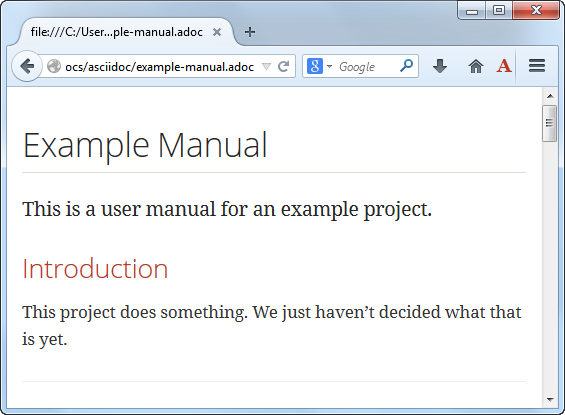
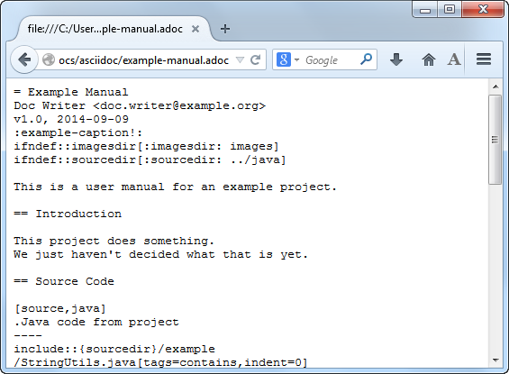

= asciidoctor-firefox-addon, Asciidoctor Firefox Addon
Guillaume Grossetie
:sources: https://github.com/asciidoctor/asciidoctor-firefox-addon
:license: https://github.com/asciidoctor/asciidoctor-firefox-addon/blob/master/LICENSE
:ff-addon-site: https://addons.mozilla.org/firefox/addon/asciidoctorjs-live-preview/
:latest-release: https://github.com/asciidoctor/asciidoctor-firefox-addon/releases/latest
:jpm-install: https://www.npmjs.com/package/jpm

This project uses https://github.com/asciidoctor/asciidoctor.js[Asciidoctor.js] to render AsciiDoc as HTML inside Firefox!

== Usage

 1. Install the extension from the {ff-addon-site}[Firefox Add-ons site] or from the {latest-release}[GitHub latest release page]. When you download the `xpi` file, if Firefox downloads it instead of directly installing it, just drag and drop it on Firefox
 1. Open local or remote `.ad`, `.adoc`, `.asc`, `.asciidoc` file in Firefox
 1. Click on the _Asciidoctor Live Preview_ button in the toolbar (button with an `A` icon) to activate or deactivate the rendering.

[[img-preview-active]]
.An asciidoc file opened in firefox with HTML preview

[[img-preview-inactive]] 
.An asciidoc file opened in firefox without HTML preview

== Local build

To manually build the extension bundle (`.xpi`) from the source you need to install {jpm-install}[jpm].

 $ npm install jpm -g

Then execute the command `jpm xpi` from the add-on's directory:

 $ jpm xpi

This command will produce an `.xpi` file. You can simply drag and drop it on Firefox to install the Add-on.

== Copyright

Copyright (C) 2013 Guillaume Grossetie.
Free use of this software is granted under the terms of the MIT License.

See the {license}[LICENSE] file for details.
